# FitTrack - Votre Partenaire Santé & Fitness

<div align="center">
  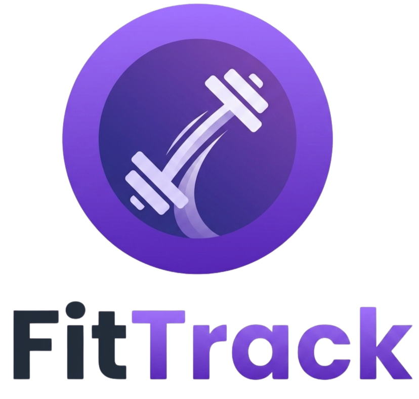
</div>

<br>

<div align="center">
  <p><strong>Suivez votre alimentation, vos entraînements et votre progression corporelle, tout en un seul endroit.</strong></p>
</div>

## Sommaire

1. [Présentation du Projet](#présentation-du-projet)
2. [Interface Utilisateur & Expérience (UX/UI)](#interface-utilisateur--expérience-uxui)
3. [Fonctionnalités Détaillées (Galerie de Captures)](#fonctionnalités-détaillées-et-démonstration-visuelle)
   - [Onboarding & Inscription](#1-onboarding--inscription-multi-étapes)
   - [Tableau de Bord & Profil](#2-tableau-de-bord-dashboard--profil)
   - [Nutrition & Planification des Repas](#3-nutrition--planification-des-repas)
   - [Activités Sportives & Entraînements](#4-activités-sportives--entraînements)
   - [Suivi du Poids & Graphiques](#5-suivi-du-poids--graphiques-fl_chart)
   - [Évolution Corporelle & Appareil Photo](#6-évolution-corporelle--appareil-photo)
4. [Architecture Logicielle & Design Patterns](#architecture-logicielle--design-patterns)
5. [Modélisation des Données & API](#modélisation-des-données--api)
6. [Instructions d'Installation et d'Évaluation](#instructions-dinstallation-et-dévaluation)

## Présentation du Projet

**FitTrack** a été conçu pour répondre à la problématique de la fragmentation des applications de santé. L'objectif de ce projet était de construire un écosystème mobile **complet et robuste** réunissant : le calcul biométrique, la journalisation diététique, l'historique sportif, et l'analyse visuelle des progrès.

## Démonstration Vidéo

> **Démo vidéo :** https://canva.link/9nhsrmkqf68px9n

## Interface Utilisateur & Expérience (UX/UI)

L'interface a été entièrement conçue dans **Figma** avant développement, garantissant une cohérence visuelle rigoureuse et une approche _design-first_. Retrouvez le design initial ici : [Consulter le fichier Figma →](https://www.figma.com/design/x4lyzofeJ8vfj6lR1mJWj1/fitTrack?node-id=206-281&t=JmVzjrNzTG7Z53Rv-1)

Le système de design repose sur trois piliers :

- **Mode Sombre Natif** : Bascule automatique ou manuelle entre un thème clair épuré et un thème sombre profond, optimisé pour la lisibilité et l'économie d'énergie.
- **Micro-interactions** : Animations implicites, transitions partagées et retours haptiques pour une expérience fluide et immersive.
- **Système typographique** : Association de `Poppins` (titres) et `Inter` (corps de texte) via Google Fonts, pour une hiérarchie visuelle claire et moderne.

## Fonctionnalités Détaillées et Démonstration Visuelle

### 1. Onboarding

Un flux de bienvenue interactif conçu pour capter l'attention de l'utilisateur dès le premier lancement.

|                                                     |                                                     |                                                     |                                                     |
| :-------------------------------------------------: | :-------------------------------------------------: | :-------------------------------------------------: | :-------------------------------------------------: |
|  |  |  | 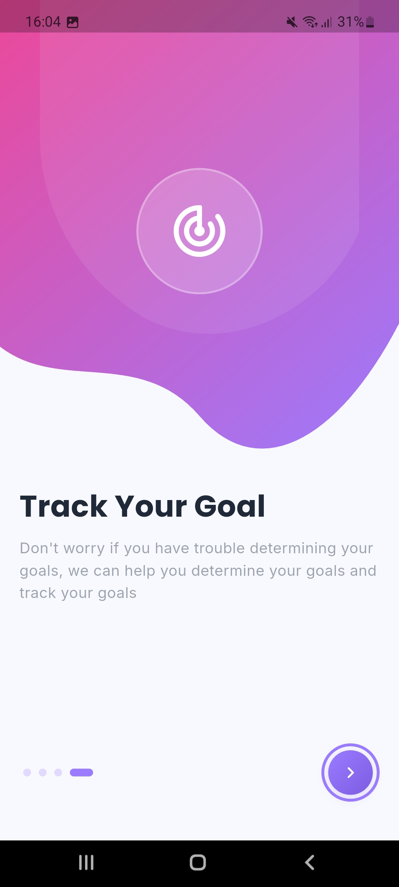 |

---

### 2. Inscription Multi-Étapes

Un formulaire d'inscription biométrique progressif. L'application calcule immédiatement l'objectif calorique et l'IMC en fonction des données saisies (poids, taille, date de naissance, genre et objectif final).

|                                                                                     |                                                             |                                                                              |
| :---------------------------------------------------------------------------------: | :---------------------------------------------------------: | :--------------------------------------------------------------------------: |
|                     | 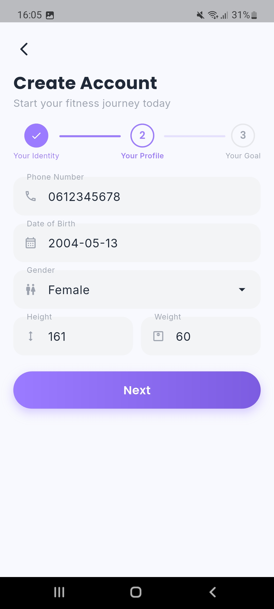 | 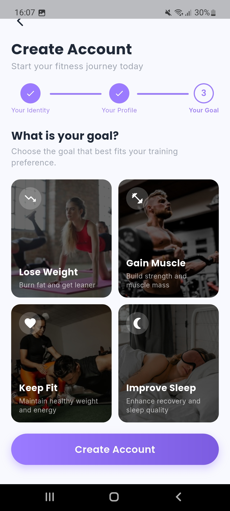 |
|  |                                                             |                                                                              |

### 3. Tableau de Bord Principal (Dashboard)

Le tableau de bord constitue le **centre névralgique** de l'application. Dès la connexion, il agrège en temps réel les données provenant de l'ensemble des modules actifs : nutrition, activité physique et suivi du poids : pour offrir une vue synthétique et immédiate de la journée.

**Fonctionnalités clés :**

- Affichage du **solde calorique en temps réel** (calories consommées vs. objectif journalier)
- Récapitulatif des macronutriments (Protéines, Glucides, Lipides)
- Recommandations contextuelles basées sur les données de l'utilisateur
- Indicateurs visuels de progression vers l'objectif fixé lors de l'inscription

|                                                         |                                                            |                                                       |
| :-----------------------------------------------------: | :--------------------------------------------------------: | :---------------------------------------------------: |
|  |  |  |

### 4. Profil Utilisateur

L'écran de profil centralise toutes les informations biométriques et personnelles enregistrées lors de l'inscription. L'utilisateur peut consulter et modifier ses données à tout moment, ce qui déclenche automatiquement un recalcul de l'objectif calorique et de l'IMC.

**Données affichées :**

- Informations personnelles (nom, genre, date de naissance)
- Métriques corporelles (poids actuel, taille, IMC calculé)
- Objectif actif et apport calorique journalier cible

|                                                  |                                                          |
| :----------------------------------------------: | :------------------------------------------------------: |
|  |  |

### 5. Nutrition & Planification des Repas

L'un des modules les plus complexes de l'application. Il repose sur une base de données nutritionnelle étendue et propose deux modes de journalisation complémentaires, couvrant aussi bien les repas composés d'ingrédients individuels que les recettes complètes prêtes à l'emploi.

**Fonctionnalités clés :**

- Recherche en temps réel dans la base de données d'**ingrédients individuels**
- Sélection de **"Ready Meals"** : des recettes complètes avec macros pré-calculés
- Organisation par **type de repas** : Petit-déjeuner, Déjeuner, Dîner, Collation
- `CalorieProgressBar` : barre de progression colorée se mettant à jour de façon réactive à chaque ajout
- Historique journalier complet avec détail des apports par repas

|                                                                     |                                                                               |                                                                     |
| :-----------------------------------------------------------------: | :---------------------------------------------------------------------------: | :-----------------------------------------------------------------: |
|  |  |               |
|                 |                    | 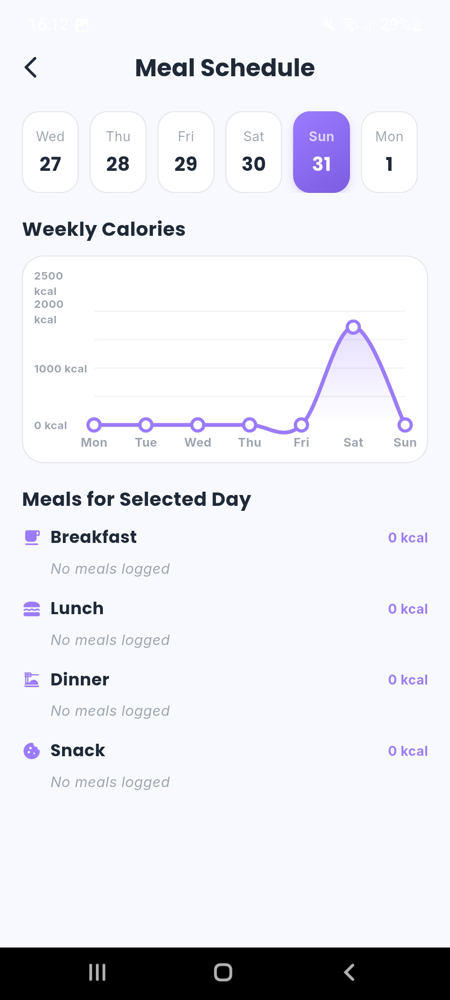 |

### 6. Activités Sportives & Entraînements

Ce module met à disposition une bibliothèque d'exercices complète, navigable via une barre de recherche textuelle. Chaque exercice dispose d'une fiche détaillée et d'un mécanisme de calcul dynamique des calories brûlées, adapté à la durée et au profil de l'utilisateur.

**Fonctionnalités clés :**

- Bibliothèque d'exercices **filtrable en temps réel** par nom ou catégorie
- `BottomSheet` interactif au tap sur un exercice : saisie de la durée en minutes et **calcul instantané** des calories brûlées via la variable scalaire propre à chaque exercice
- Enregistrement de la session dans l'historique avec horodatage
- **Historique des entraînements** : consultation des sessions passées avec détail des calories dépensées

|                                                          |                                                                                   |                                                                                   |
| :------------------------------------------------------: | :-------------------------------------------------------------------------------: | :-------------------------------------------------------------------------------: |
|     |  |  |
|  |                                                                                   |                                                                                   |

### 7. Suivi du Poids & Visualisation Graphique

Le module de suivi du poids offre une lecture analytique de l'évolution corporelle dans le temps. Il s'appuie sur la librairie `fl_chart` pour générer des courbes fluides et lisibles, permettant à l'utilisateur d'identifier ses tendances et progrès sur différentes périodes.

**Fonctionnalités clés :**

- Enregistrement manuel d'une nouvelle pesée avec date automatique
- Courbes de Bézier pour un rendu graphique smooth et professionnel
- **Trois intervalles temporels** sélectionnables dynamiquement : 30 jours, 3 mois, 6 mois
- Recalcul automatique des points du graphique selon l'intervalle choisi pour lisser la courbe
- Affichage du poids minimum, maximum et de la tendance globale

|                                                               |                                                             |                                                              |
| :-----------------------------------------------------------: | :---------------------------------------------------------: | :----------------------------------------------------------: |
|  |  | 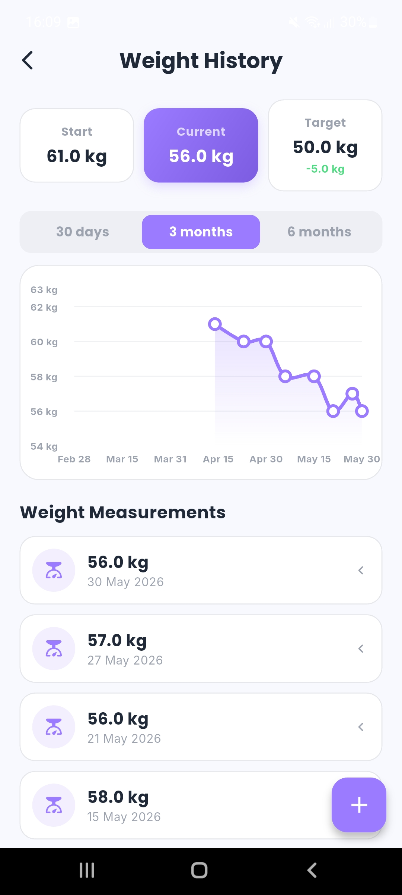 |
|  |                                                             |                                                              |

### 8. Évolution Corporelle & Suivi Photo

Ce module renforce la prise de conscience de l'utilisateur en permettant la capture et la comparaison d'images **avant / après**. Il interagit directement avec le hardware de l'appareil pour offrir une expérience native et fluide.

**Fonctionnalités clés :**

- Accès natif à la **caméra** et à la **galerie** via `image_picker`
- Conversion et optimisation automatique des images avant stockage
- Persistance locale des fichiers via `path_provider` (répertoire système de l'OS)
- Référencement des photos par chemin absolu (`file:///`) dans la base de données
- Vue comparative pour visualiser sa progression dans le temps

|                                                         |                                                   |                                                               |
| :-----------------------------------------------------: | :-----------------------------------------------: | :-----------------------------------------------------------: |
|    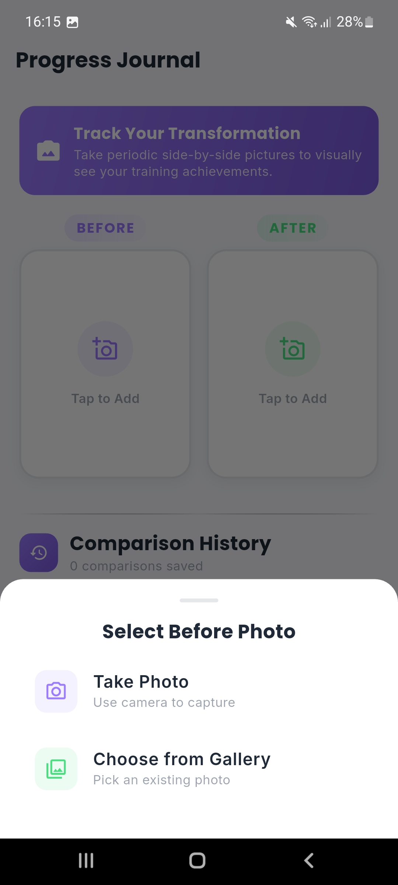    | 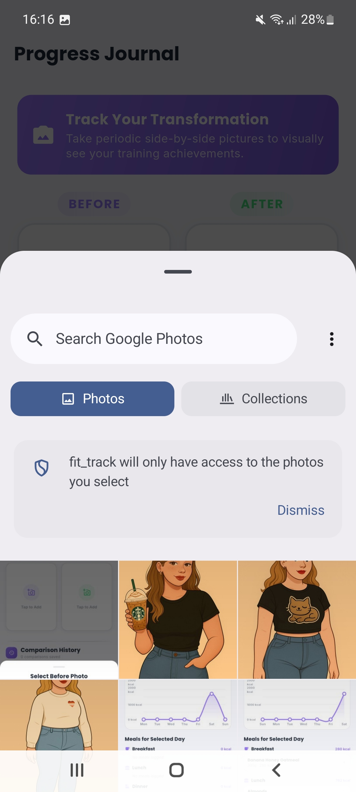 |       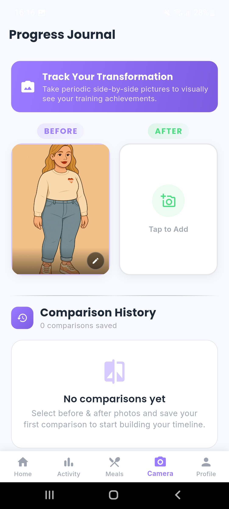       |
|    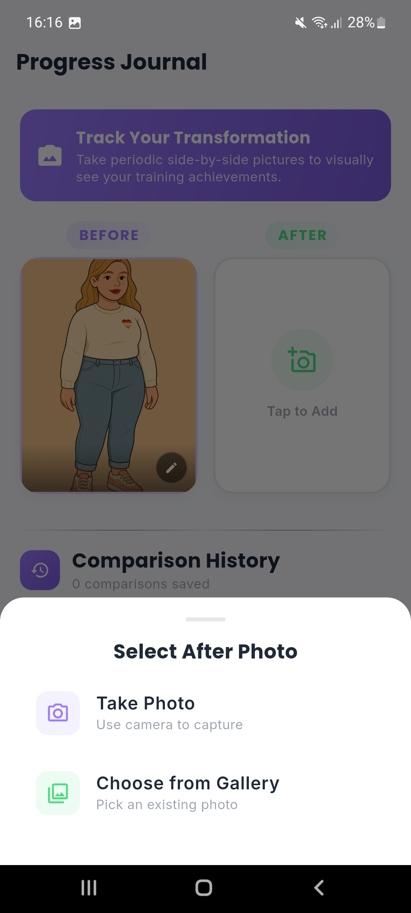    |  |  |
|  |                                                   |                                                               |

## Architecture Logicielle & Design Patterns

L'application respecte les principes **SOLID** et adopte une architecture en couches strictement séparées, inspirée du pattern **MVVM (Model-View-ViewModel)**. Cette approche garantit une séparation claire des responsabilités, facilitant la maintenabilité, la testabilité et la scalabilité du projet.

### Couches architecturales :

1. **Couche Données : Models**
   Classes fortement typées (`User`, `Food`, `ActivityLog`, etc.) avec sérialisation / désérialisation JSON complète (`fromJson` / `toJson`) et conformité stricte au **Null Safety** de Dart.

2. **Couche Service : Services**
   `ApiService` est un **singleton** centralisant toutes les communications réseau asynchrones (REST). Il intègre un algorithme de gestion des **Timeouts** et d'interception des exceptions réseau. `PreferencesService` gère quant à lui la persistance des variables de session utilisateur.

3. **Couche Contrôle : Controllers (ViewModel)**
   Pont entre les données et la vue. Chaque controller étend `ChangeNotifier` (pattern **Provider**), reçoit l'`ApiService` par injection de dépendances, encapsule la logique métier (calculs nutritionnels, filtrage, agrégation) et notifie l'interface via `notifyListeners()`.

4. **Couche Présentation : Views**
   Widgets Flutter sans logique métier embarquée. Ils s'abonnent passivement aux Controllers via `context.watch()` et réagissent aux trois états fondamentaux : **chargement**, **succès** et **erreur**.

## Modélisation des Données & API

Le projet a évolué d'une architecture SQLite locale vers une architecture **Client-Serveur RESTful** reposant sur `json-server`, simulant un backend de production complet. L'application communique exclusivement via des requêtes HTTP asynchrones (GET, POST, PUT, DELETE).

### Points de terminaison implémentés (`db.json`) :

| Endpoint                | Description                                                                 |
| ----------------------- | --------------------------------------------------------------------------- |
| `/users`                | Gestion des profils utilisateurs, mots de passe hashés et tokens de session |
| `/exercises`            | Catalogue complet des exercices avec variables caloriques                   |
| `/foods`                | Base de données des ingrédients individuels avec valeurs nutritionnelles    |
| `/ready_meals`          | Recettes complètes avec macronutriments pré-calculés                        |
| `/meal_logs`            | Historique croisé : utilisateur x aliment x type de repas x date            |
| `/activity_logs`        | Historique des sessions d'entraînement avec durée et calories               |
| `/weight_entries`       | Série temporelle des pesées par utilisateur                                 |
| `/progress_comparisons` | Références des chemins locaux (`file:///`) des photos avant/après           |

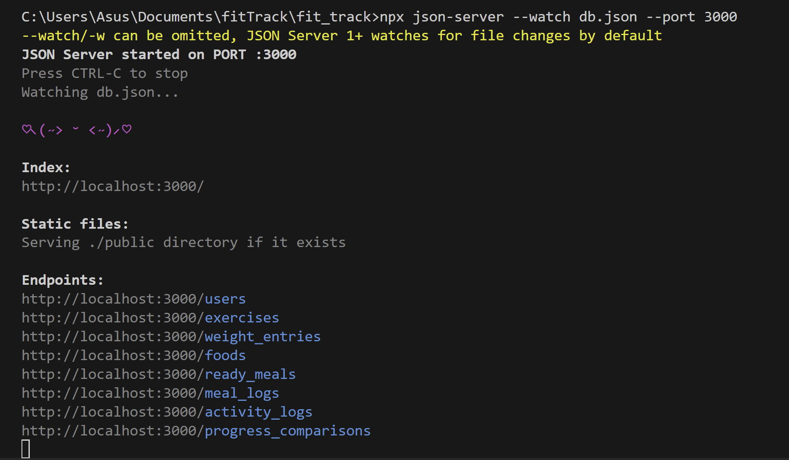

|                                                  |                                                         |
| :----------------------------------------------: | :-----------------------------------------------------: |
|     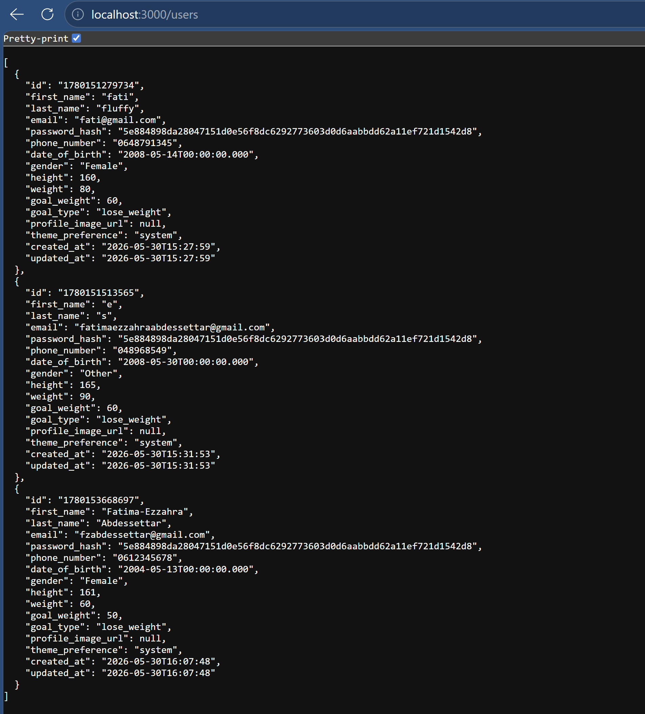     |      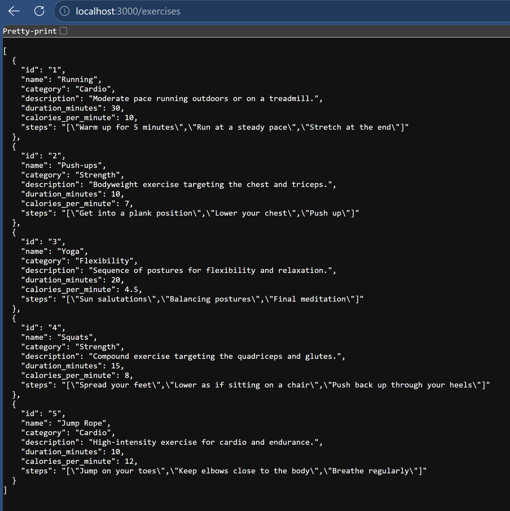       |
|     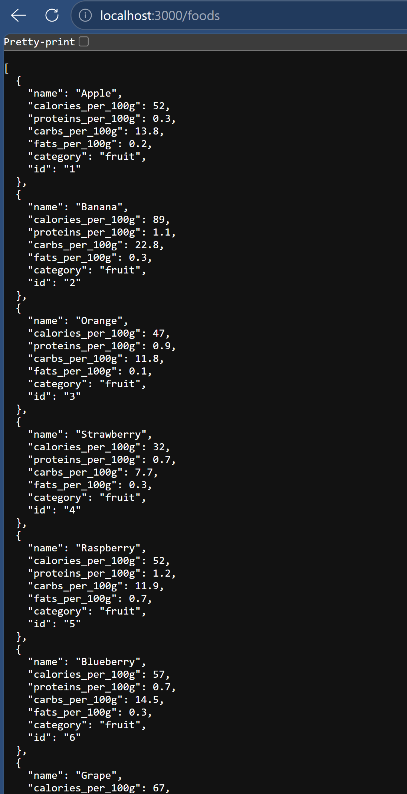     |     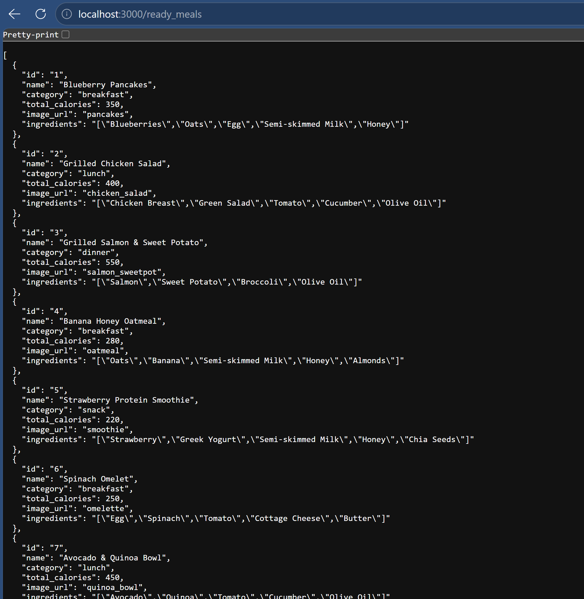      |
|   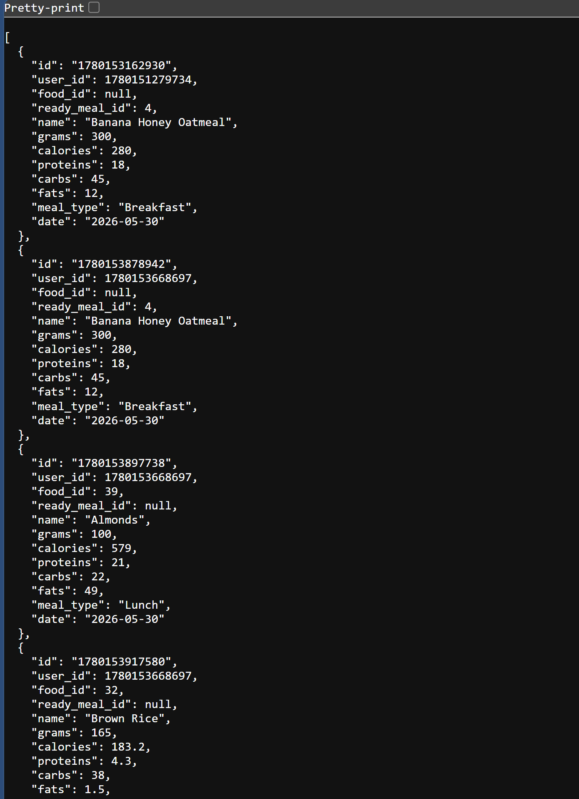   |    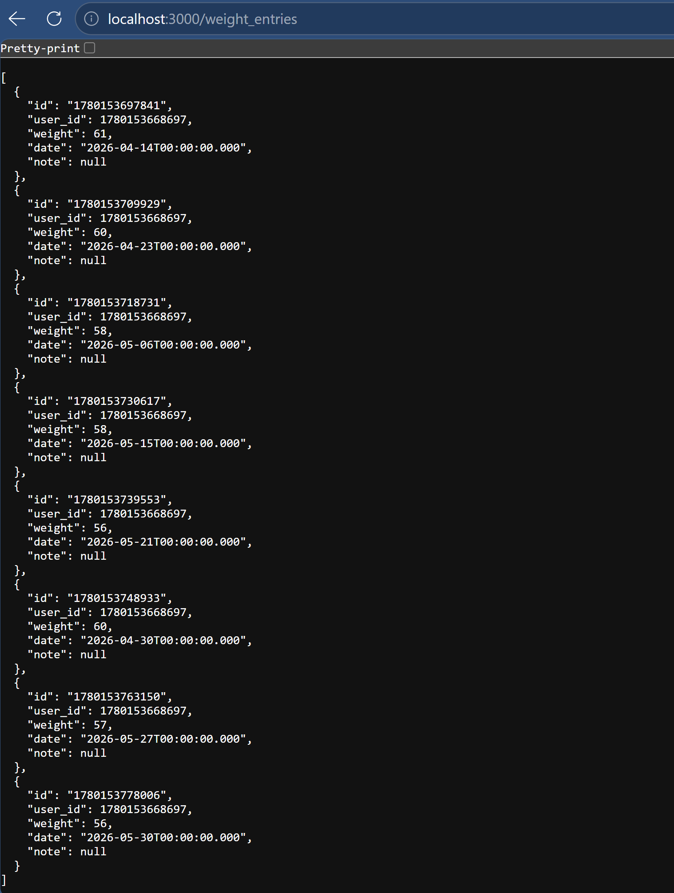    |
| 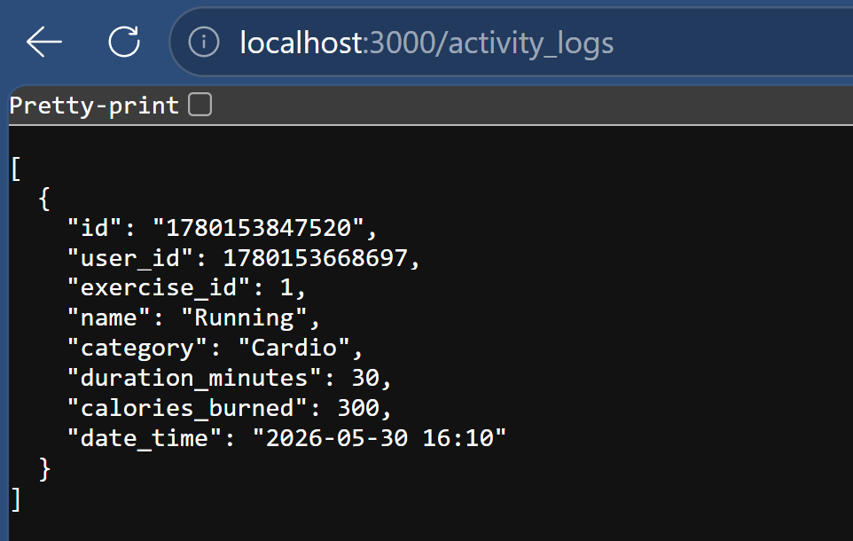 | 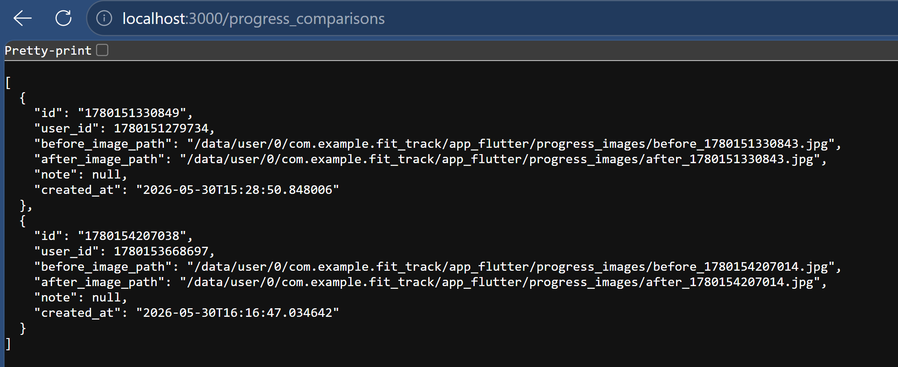 |

---

## Instructions d'Installation

### Prérequis

| Outil       | Version minimale      |
| ----------- | --------------------- |
| Flutter SDK | v3.12.0               |
| Dart SDK    | Inclus avec Flutter   |
| Node.js     | v16.0.0 ou supérieure |

### Étapes de déploiement

**1. Cloner le projet et installer les dépendances Flutter :**

```bash
flutter clean
flutter pub get
```

**2. Démarrer le serveur API _(Étape obligatoire)_ :**

Le fichier `db.json` embarque des seeders de données pour simuler les données réelles d'une application en production.

```bash
npx json-server --watch db.json --port 3000
```

**3. Lancer l'application :**

```bash
flutter run
```

---

<div align="center">
  <i>Développé par ABDESSETTAR Fatima-Ezzahra dans le cadre d'un projet universitaire Flutter encadré par Pr. TBATOU Zakaria.</i>
</div>
